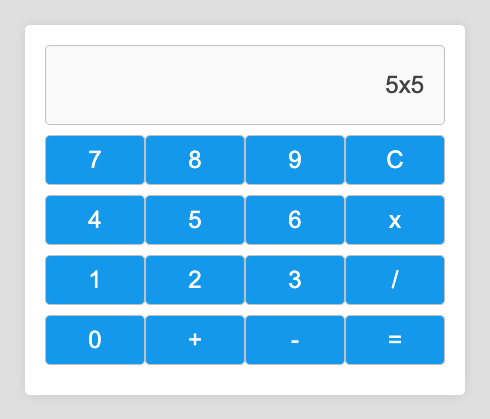
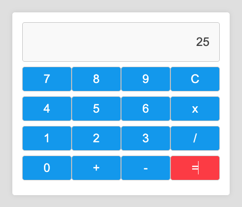
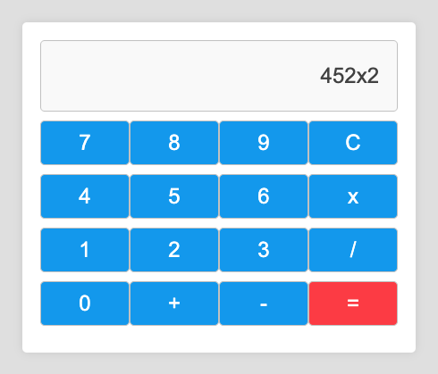
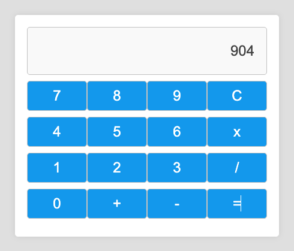

# Calculadora com React

Este projeto é uma calculadora simples criada com React. Ele permite que você realize operações matemáticas básicas, como adição, subtração, multiplicação e divisão.

## Screenshots





## Feito com
- NodeJS - v21.5.0
- React - v18.2.0
- Styled Components - v6.1.8

## Instalação
Para instalar e rodar este projeto, siga os seguintes passos:

1. Clone o repositório para a sua máquina local usando git clone https://github.com/edwinbustillos/calculadora-react.git.

2. Navegue até o diretório do projeto usando cd calculadora-react.

3. Instale todas as dependências do projeto usando:
```
npm install.
```

4. Inicie o servidor de desenvolvimento usando:
```
npm start.
```

5. O aplicativo agora deve estar rodando em http://localhost:3000.

## Uso
Para usar a calculadora, basta clicar nos botões numéricos e de operação para inserir uma operação. Clique no botão '=' para calcular o resultado. Clique no botão 'C' para limpar a operação atual.

## Contribuição
Contribuições são sempre bem-vindas. Se você tem alguma ideia para melhorar o aplicativo, sinta-se à vontade para fazer um fork e enviar um pull request.